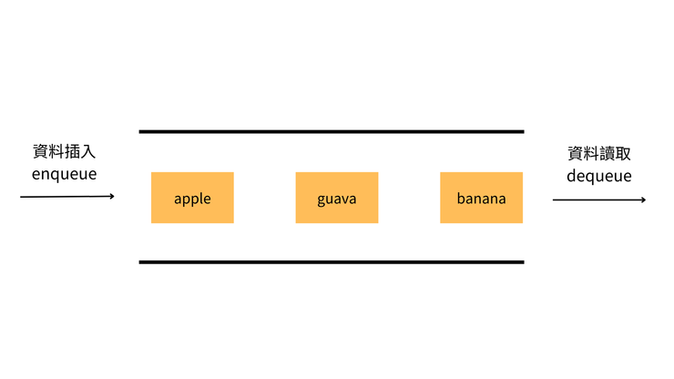
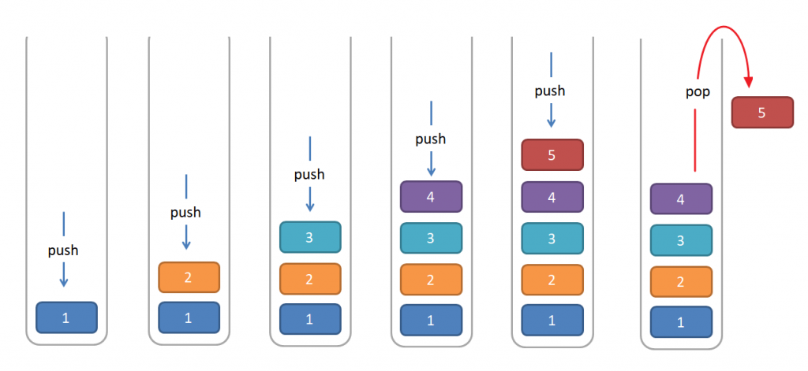

# Queue & Stack notes

## Description
### Queue (FIFO)
- A linear data structure operating on the **First-In-First-Out (FIFO)** principle.
- Elements are added at the **"rear"** (enqueue) and removed from the **"front"** (dequeue).
- Common operations:
    - **Enqueue:** Add an element to the rear.
    - **Dequeue:** Remove an element from the front.
    - **Front/Peek:** Access the front element without removing it.
    - **IsEmpty:** Check if the queue contains any elements.
### Stack (LIFO/FILO)
- A linear data structure operating on the **Last-In-First-Out (LIFO)** or **First-In-Last-Out (FILO)** principle.
- Elements are added and removed from the same end, called the **"top"**.
- Common operations:
    - **Push:** Add an element to the top.
    - **Pop:** Remove the top element.
    - **Peek/Top:** Access the top element without removing it.
    - **IsEmpty:** Check if the stack contains any elements.

## Visualization
### Queue

### Stack

